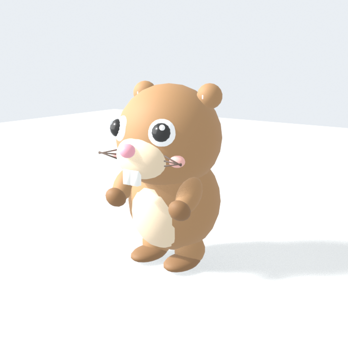

# Gopher Run

A cute gopher that runs around a bare-bones grid world. The gopher is modelled
procedurally in Blender and the game is plain HTML/CSS/JS on top of Babylon.js.



## Play

Open `web/index.html` in a browser. No server or build step is needed: the
model is inlined into `web/gopher-model.js`, and Babylon.js loads from its CDN.

| Input | Action |
| --- | --- |
| WASD / arrow keys | Run (relative to the camera) |
| Shift | Sprint |
| Space | Jump |
| Mouse drag / wheel | Orbit / zoom the camera |

## Rebuild the model

Requires Blender (tested with 5.2 LTS on macOS). The script runs headless.

```sh
./build.sh              # export GLB, render previews, regenerate web/gopher-model.js
./build.sh --no-render  # skip the preview renders
BLENDER=/path/to/blender ./build.sh
```

## Reference-inspired variants

Two additional Blender-authored GLBs reproduce the cream gopher, black body
stripes, and windswept scarf from the supplied drawing. The cloud variant uses
the same character and adds a solid, fully opaque cloud made from overlapping
soft puffs.

```sh
./build-variants.sh              # GLBs, editable .blend files, and previews
./build-variants.sh --no-render  # skip previews
```

| Asset | Contents |
| --- | --- |
| `assets/gopher-scarf.glb` | Grounded scarf gopher, feet at the origin |
| `assets/gopher-scarf-cloud.glb` | Same gopher lifted onto an opaque white cloud |
| `blender/gopher-scarf.blend` | Editable grounded source scene |
| `blender/gopher-scarf-cloud.blend` | Editable cloud source scene |

Both variants keep the generic model's `Gopher`, `Body`, `Head`, limb, tail,
and eye node names. A cloud appearance/disappearance transition is intentionally
not baked into either model: switching or cross-fading between two GLBs is game
state, so it should be implemented in the runtime when that behavior is defined.

## Layout

```
blender/gopher.py     Builds the gopher from primitives and exports assets/gopher.glb
blender/gopher_scarf.py Builds the grounded/cloud scarf variants
build-variants.sh     Rebuilds both scarf variants and their editable scenes
assets/gopher.glb     The model (Y-up glTF, faces +Z, feet on y=0, 1 unit tall)
assets/*.png          Eevee preview renders from four angles
web/index.html        Page shell and HUD
web/style.css         Minimal styling
web/game.js           World, controls, camera, collision, procedural animation
web/gopher-model.js   Generated: the GLB as a base64 string
build.sh              Runs Blender and regenerates gopher-model.js
```

## How the gopher is built

`blender/gopher.py` assembles the character from scaled spheres and boxes,
each placed so its origin sits at the joint it should rotate around (neck,
shoulders, hips, tail base). The object hierarchy is exported as glTF nodes
with these names, which `game.js` looks up and animates in code:

```
Gopher
└─ Body
   ├─ Head  (Muzzle, Nose, ToothL/R, EyeL/R, EarL/R, CheekL/R, whiskers)
   ├─ ArmL / ArmR  (HandL / HandR)
   ├─ LegL / LegR  (FootL / FootR)
   ├─ Belly
   └─ Tail
```

There is no armature. Running, idling, blinking and jumping are all
sinusoidal transforms applied to these nodes at runtime, which keeps the
model small (about 130 KB) and the pipeline simple.
